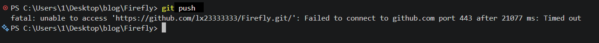

# Git push 超时：排查与代理配置

## 问题现象


浏览器能正常访问 GitHub，但在 PowerShell 中执行 `git push` 时出现错误：

```text
Failed to connect to github.com port 443 ... Timed out
```

也曾出现连接中断：

```text
OpenSSL SSL_read: Connection was aborted, errno 10053
```

这些错误出现在推送阶段，不代表本地提交失败。已经成功执行的 `git commit` 不会因此丢失，不需要重复提交。

## 本次检查结果

- Windows 系统代理已开启，地址为 `127.0.0.1:7877`。
- 博客仓库没有保存 Git 代理配置。
- 显式指定代理后，Git 能成功查询 GitHub 远程分支。
- 保存仓库级代理配置后，普通 Git 命令也能成功连接，随后 `git push` 恢复正常。

浏览器和 Git 不一定使用相同的代理设置。浏览器能访问 GitHub，并不能证明 Git 的连接路径也正常。本次通过给 Git 指定现有本机代理解决了问题。

## 操作步骤

### 1. 进入博客项目目录

在 PowerShell 中执行：

```powershell
Set-Location -LiteralPath 'C:\Users\1\Desktop\blog\Firefly'
```

### 2. 检查系统代理和 Git 配置

查看 Windows 系统代理：

```powershell
Get-ItemProperty 'HKCU:\Software\Microsoft\Windows\CurrentVersion\Internet Settings' |
    Select-Object ProxyEnable, ProxyServer
```

本次检查结果为：

```text
ProxyEnable ProxyServer
----------- -----------
          1 127.0.0.1:7877
```

`ProxyEnable` 为 `1` 表示已启用系统代理。`127.0.0.1` 表示自己的电脑，`7877` 是代理软件监听的端口。

查看 Git 代理配置及其来源：

```powershell
git config --show-origin --get-regexp '^(http\..*proxy|http\.proxy|https\.proxy)$'
```

本次没有输出匹配项。注意，这只是在检查 Git 配置；其他电脑还可能通过环境变量或远程仓库专用设置配置代理。

### 3. 临时指定代理，测试连接

保持代理软件运行，执行：

```powershell
git -c http.proxy=http://127.0.0.1:7877 ls-remote origin refs/heads/master
```

- `-c http.proxy=...`：只为这一次命令指定代理，不保存配置。
- `ls-remote`：只查询远程仓库，不上传或修改代码。
- `origin`：博客的 GitHub 远程仓库。
- `refs/heads/master`：查询 `master` 分支。

成功时会返回一串提交编号和 `refs/heads/master`，证明该代理可以帮助 Git 连接远程仓库。本次测试成功。

### 4. 保存到当前仓库

```powershell
git config --local http.https://github.com.proxy http://127.0.0.1:7877
```

- `--local`：只对当前博客仓库生效。
- `http.https://github.com.proxy`：访问 HTTPS GitHub 地址时使用该代理。
- 配置保存在项目的 `.git/config` 中，不会随着文章和代码推送到 GitHub。

此操作没有修改全局 Git 配置，也没有关闭 HTTPS 证书校验。

### 5. 验证保存结果

查看这个仓库地址实际匹配的代理：

```powershell
git config --get-urlmatch http.proxy https://github.com/lx23333333/Firefly.git
```

预期输出：

```text
http://127.0.0.1:7877
```

再使用不带临时代理参数的命令测试：

```powershell
git ls-remote origin refs/heads/master
```

本次同样成功，说明保存的配置已生效。

### 6. 正常推送

```powershell
git push
```

成功时会看到类似：

```text
master -> master
```

推送成功表示代码已上传 GitHub；博客还需要等待 Cloudflare 自动构建和部署完成，线上内容才会更新。

## 日常使用注意事项

### 关闭代理软件后还能推送吗？

当前配置要求 Git 通过本机代理连接。关闭代理软件后，如果没有程序监听 `7877`，推送就会失败。推送前先打开代理软件。

### 重启电脑会改变端口吗？

通常不会。端口一般保存在代理软件配置中，重启后仍为原值。但如果软件没有开机启动，需要手动打开它。

手动修改端口、重置配置、更换代理软件，或者软件因端口冲突自动调整时，端口可能改变。

### 端口变化后怎么办？

重新检查代理软件当前的 HTTP 或混合代理端口，再执行保存配置的命令，将 `7877` 改成实际端口。例如端口改为 `7890` 时：

```powershell
git config --local http.https://github.com.proxy http://127.0.0.1:7890
```

`7877` 只是这台电脑当时的配置，不是所有电脑都使用的固定端口。

### 如何取消这项配置？

在博客项目目录执行：

```powershell
git config --local --unset http.https://github.com.proxy
```

这会删除本次保存的仓库级设置。如果还有全局配置或代理环境变量，Git 仍可能使用其他代理。

### 配置后仍然失败怎么办？

1. 确认代理软件已启动，代理端口与 Git 配置一致。
2. 重新执行 `git ls-remote origin refs/heads/master`，区分连接问题与推送问题。
3. 如果连接正常但推送报 `403`、身份验证失败或远程分支领先，需要根据新的错误处理；它们不是这次的连接超时问题。
4. 不要通过关闭 SSL 证书校验来处理连接超时，也不要为了重试网络错误使用强制推送。

## 参考

- [Git 官方文档：git config](https://git-scm.com/docs/git-config)
- 相关配置项：`http.proxy`、`http.<url>.*`、`--local`。
